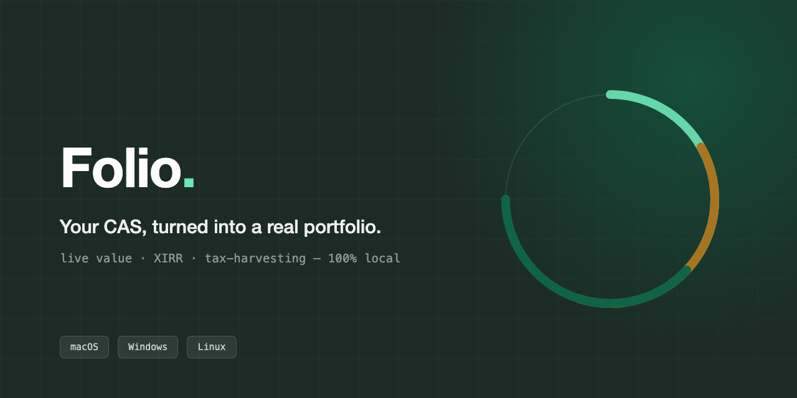
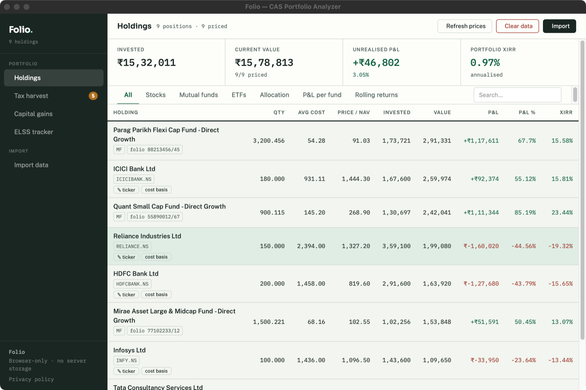
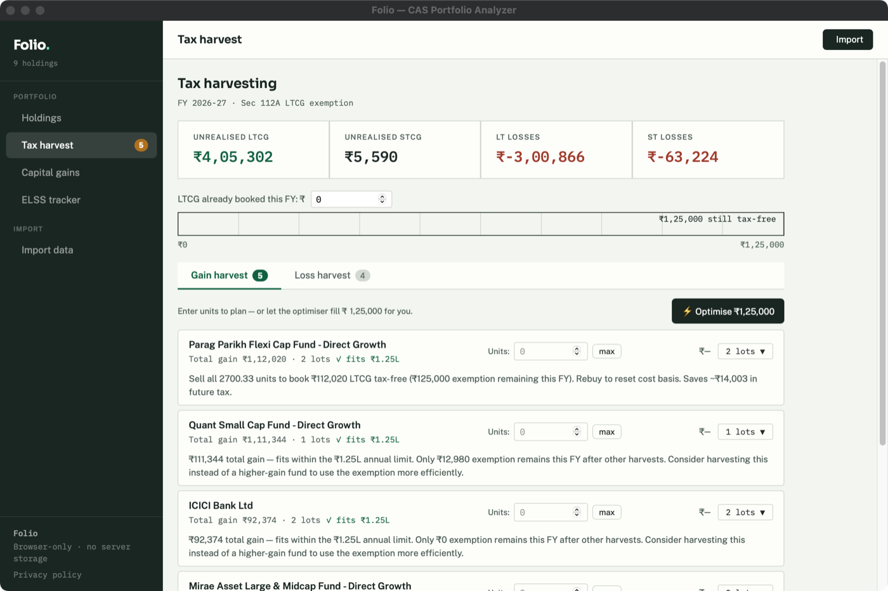
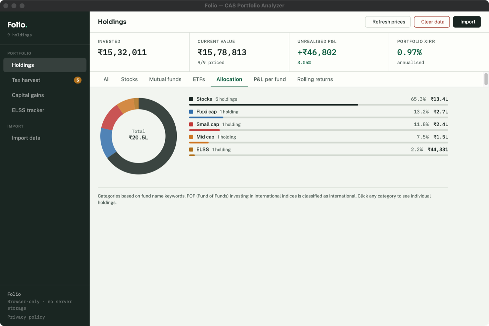
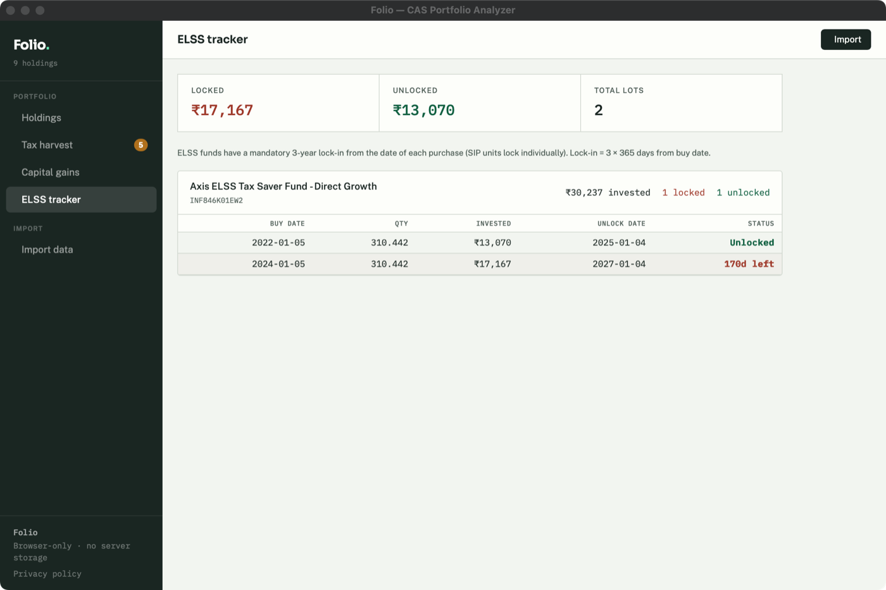
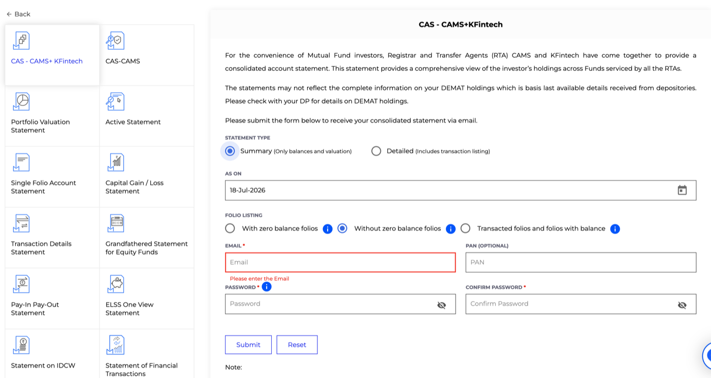

# Folio — CAS Portfolio Analyzer

Folio reads your NSDL/CDSL Consolidated Account Statement (the PDF your
depository emails you every month) and turns it into a real portfolio view:
live current value, returns (XIRR) per holding and overall, and Indian
tax-harvesting suggestions — all without sending your data anywhere.



> Screenshots throughout this README use a fabricated demo portfolio, not
> real account data.

## What it does

- **See what you actually own** — every stock and mutual fund holding from
  your CAS, in one table, with live prices.
- **Know your real returns** — XIRR per holding and for your whole portfolio,
  not just "gain since I bought it."
- **Get tax-harvesting suggestions** — which lots to sell to use up your
  ₹1.25L long-term capital gains exemption, and which losses can offset
  gains, before the financial year ends.
- **Filter and drill in** — by stock, by fund, by account.

<table>
<tr>
<td></td>
<td></td>
</tr>
<tr>
<td align="center"><sub>Tax-harvesting suggestions</sub></td>
<td align="center"><sub>Allocation breakdown</sub></td>
</tr>
<tr>
<td colspan="2"></td>
</tr>
<tr>
<td colspan="2" align="center"><sub>ELSS lock-in tracker</sub></td>
</tr>
</table>

## Getting Folio

Download the build for your OS from the
[Releases page](../../releases) (or the latest
[Actions run](../../actions) artifacts):

- **macOS** — `.dmg` (Apple Silicon or Intel — pick the matching one)
- **Windows** — `.msi` or the `.exe` installer
- **Linux** — `.deb` or `.AppImage`

Folio is a desktop app: it opens like any other application on your
computer, with no browser tab, no sign-in, and no account to create.

> First launch takes a few seconds longer than usual while it starts its
> local backend — that's normal.

**macOS "Apple could not verify this app" / can't open it:** Folio isn't
signed with a paid Apple Developer ID, so Gatekeeper blocks it on first
launch. Right-click the app → **Open** (instead of double-clicking), then
confirm in the dialog that appears — you only need to do this once. If
macOS instead says the app **"is damaged"**, that specific wording means
Gatekeeper doesn't trust the download at all rather than just warning about
an unknown developer; run this once in Terminal, then open it normally:
```bash
xattr -cr /Applications/Folio.app
```

## Using it

Upload your data on Folio's **Import data** page:

1. **CAS — CAMS + KFinTech Consolidated Statement (PDF)** — get it from
   [CAMS](https://www.camsonline.com/Investors/Statements/Consolidated-Account-Statement)
   or [KFintech](https://mfs.kfintech.com/investor/General/InvestorTransactionReport)
   with the **Detailed** option. Password is your PAN in capitals. This
   single file covers all your mutual fund holdings and transaction history.

   

2. **(Optional) Zerodha tradebook (CSV)** — Console → Reports → Tradebook.
   Needed for stock/ETF trades not in the CAS. Select multiple FY files at
   once — duplicates removed automatically. Or use the Generic tradebook
   option for any other broker (columns: `isin,date,side,quantity,price`).


That's it — you can also add a generic tradebook CSV from any broker.
See the Import page itself for full details on each option.

## Privacy

Nothing about your portfolio ever leaves your computer except two things it
has to fetch to be useful: fund NAVs from AMFI and stock prices from Yahoo
Finance — neither request carries any of your personal data.

- Your CAS PDF is parsed locally and never uploaded to a server.
- Your holdings and trades are stored only in the app itself, on your
  machine.
- There's no account, no login, and no analytics.
- "Clear data" removes everything Folio has stored, permanently.

## A note on tax-harvesting suggestions

Folio models the FY 2025-26 Indian equity tax rules (Sec 112A long-term
gains, Sec 111A short-term gains) as accurately as it can, but it doesn't
account for everything — pre-2018 grandfathering, debt/gold fund taxation,
and intraday/speculative income aren't modelled. **This is not tax advice**;
verify anything material with a tax professional before acting on it.

## Building from source / contributing

See [DEVELOPMENT.md](DEVELOPMENT.md).
