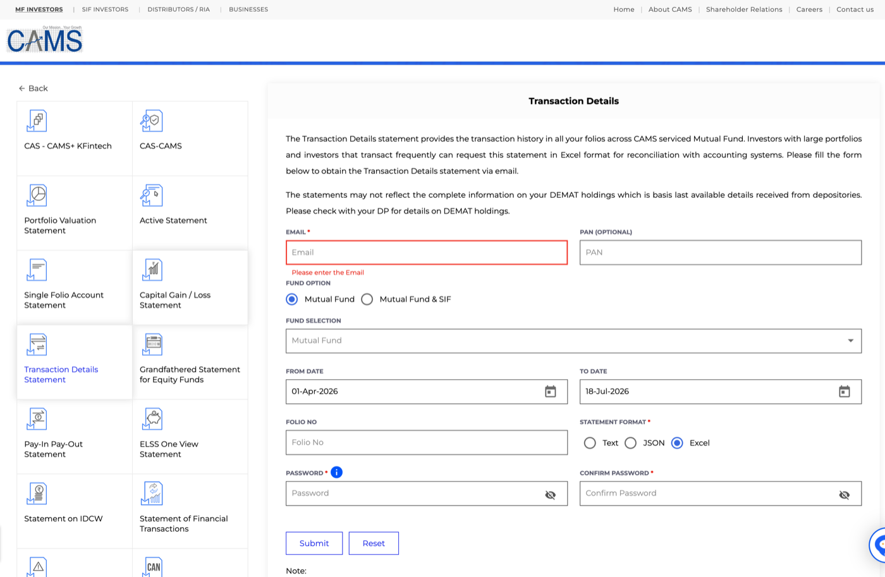
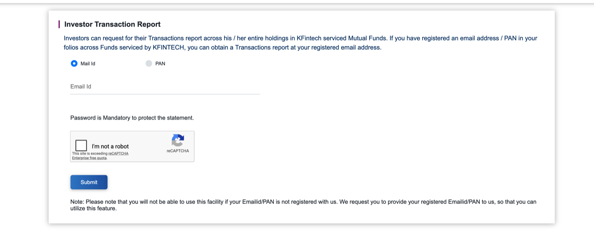

# Uploading your data to Folio

Folio's **Import data** page has five upload boxes. You don't need all five —
most people only ever need #1 and #4 (or #1 and #5). This guide explains what
each one is for, where to get the file, and what happens if you skip it.

## Quick answer: what do I actually need?

- **Just want to see what you own, today?** Upload #1 (CAS) and stop there.
- **Want accurate returns (XIRR) and tax-lot math?** Also upload your buy
  history — #4 if you trade stocks via Zerodha, #5 for any other broker or a
  hand-built CSV, or #2/#3 for mutual fund transaction history from CAMS or
  KFintech.

You can mix and match — e.g. CAS for holdings, Zerodha tradebook for stocks,
and CAMS for mutual funds, all in the same portfolio.

---

## 1 · CAS (PDF) — start here

**What it is:** The NSDL or CDSL Consolidated Account Statement — a single
PDF listing every stock and mutual fund folio you hold across all your demat
accounts and registrars.

**Where to get it:**
- [CDSL](https://www.cdslindia.com/) → Investors → e-CAS, or
- [NSDL](https://www.nsdl.co.in/) → CAS statement request

Both let you email yourself a PDF for a date range (usually "current month"
or "since inception").

**Password:** Your PAN number in capital letters (e.g. `ABCDE1234F`). This is
set by the depository, not something Folio generates.

**What happens after upload:** Folio extracts every holding — name, ISIN,
quantity, folio number — into the Holdings table. This is a *snapshot*: it
tells you what you own right now, not when you bought it, so returns shown
immediately after this step alone are approximate (Folio will say so on
screen).

> **If you only hold mutual funds and have no demat account**, NSDL/CDSL may
> not issue you a CAS at all. CAMS and KFintech jointly offer a
> [Consolidated Account Statement](https://www.camsonline.com/Investors/Statements/Consolidated-Account-Statement)
> covering funds serviced by both RTAs as a fallback — but note Folio's CAS
> parser is built specifically for the NSDL/CDSL PDF format, so this
> alternative statement isn't guaranteed to parse cleanly in upload box #1.
> Use it as a reference for your holdings, and rely on #2/#3 below for
> transaction history either way.
>
> 

---

## 2 · CAMS history (XLS)

**What it is:** Your complete mutual fund transaction history for funds
serviced by CAMS (Aditya Birla Sun Life, DSP, HDFC, ICICI Prudential, Kotak,
SBI, Parag Parikh, Navi, and others).

**Where to get it:** [CAMS Transaction Details Statement](https://www.camsonline.com/Investors/Statements/Transaction-Details-Statement):

1. **Email** — required (statement gets emailed here). PAN is optional.
2. **Fund Option** — leave as **Mutual Fund**.
3. **Fund Selection** — open the dropdown and explicitly select **All**
   (or select every fund you hold individually) — it isn't included by
   default if left blank.
4. **From Date / To Date** — set From Date as early as possible (e.g. your
   account opening date, or just `01-01-2000` to be safe) and To Date to
   today, so you get your complete history in one file.
5. **Folio No** — leave blank to include all folios.
6. **Statement Format** — choose **Excel** (Folio's parser expects the XLS
   format; Text/JSON aren't supported).
7. Set a **Password** and **Confirm Password** — this protects the emailed
   file.

CAMS emails the password-protected XLS to the address you entered.

**Before uploading:** Folio can't open a password-protected Excel file
directly. Open the XLS in Excel/Google Sheets/LibreOffice using the password
you set, then **save a copy without a password** (File → Save As, leave the
password field blank) — upload that unprotected copy to Folio.

**Requires:** Upload your CAS first (#1) — this file has no ISIN column, so
Folio matches each transaction to a fund by folio number, and needs your CAS
holdings loaded to do that matching.

**What happens after upload:** Real buy/sell lots replace the approximate
"bought today" placeholder for every CAMS-serviced fund, so XIRR and
tax-harvest lots become accurate for those holdings.

---

## 3 · KFIN history (XLS)

**What it is:** The same idea as #2, but for funds serviced by KFintech
(Axis Mutual Fund, UTI, Mirae Asset, Nippon India, Quant, and others).

**Where to get it:** [KFintech Investor Transaction Report](https://mfs.kfintech.com/investor/General/InvestorTransactionReport):

1. Choose **Mail Id** or **PAN** to identify yourself, and fill in the
   matching field. This only works if that email/PAN is already registered
   against your folios with KFintech.
2. Set a password (required — protects the emailed statement).
3. Complete the "I'm not a robot" captcha, then **Submit**.

KFintech emails the password-protected statement to your registered email.

**Before uploading:** Same as CAMS above — open the file with the password
you set and save an unprotected copy before uploading it to Folio.

**Requires:** Nothing extra — this file already includes each transaction's
ISIN directly, so it doesn't need your CAS loaded first (though uploading
CAS is still how those holdings show up in the first place).

**What happens after upload:** Same as #2 — real lots replace the CAS
placeholder cost basis for KFintech-serviced funds.

---

## 4 · Zerodha tradebook (CSV)

**What it is:** Your full equity buy/sell history from Zerodha.

**Where to get it:** Zerodha Console → *Reports* → *Tradebook* → pick a
financial year → *Download*. Zerodha only lets you download one FY at a
time, so if you've traded across multiple years, download each year's file
separately.

**Tip:** You can select **all your yearly files at once** in the file picker
— Folio merges them and automatically removes any overlapping duplicate
trades between files.

**What happens after upload:** F&O and currency rows are skipped
automatically (Folio only tracks equity/ETF holdings); only real buys/sells
for stocks you hold are imported as lots.

---

## 5 · Generic tradebook (CSV) — any other broker

**What it is:** A catch-all CSV format for any broker Folio doesn't have a
dedicated parser for (Groww, Upstox, etc.), or for building your own trade
history by hand in a spreadsheet.

**Required columns** (header row, any order):

| Column     | Meaning                                  | Example         |
|------------|-------------------------------------------|-----------------|
| `isin`     | The security's ISIN (must match your CAS) | `INE002A01018`  |
| `date`     | Trade date                                 | `2023-06-15`    |
| `side`     | `BUY` or `SELL`                            | `BUY`           |
| `quantity` | Units/shares traded                        | `40`            |
| `price`    | Price per unit                             | `2465.00`       |
| `folio`    | *(optional)* Fund folio, for mutual funds  | `88213456/45`   |

Most broker exports map to this with a quick column rename in Excel/Sheets —
see `sample_tradebook.csv` in this repo for a working example.

**What happens after upload:** Same as #4 — real lots and cash flows are
recorded for XIRR and tax-lot math.

---

## Common questions

**Do I need to redo this every month?** Only #1 (CAS) needs periodic
re-uploading to refresh holdings/quantities. Trade history (#2–#5) only
needs new transactions added — re-uploading a file with trades you've
already imported is safe for #4 (duplicates are detected), but for #2/#3/#5
you may end up with duplicate lots if you re-upload the same period twice —
use **Clear data** and start fresh if that happens.

**What if I don't have any of #2–#5?** Folio still works — it just falls
back to average cost from the CAS, dated "today," and says so wherever it
matters (Holdings table, XIRR, tax harvest). Numbers are directionally
useful but not precise until real buy history is loaded.

**Is any of this uploaded anywhere?** No — see the Privacy section in the
main [README](README.md).
